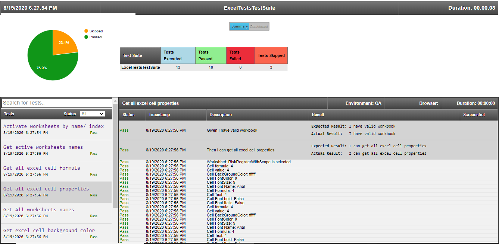

# Selenium-C#-Specflow-Excel
Excel Tests using C# and Specflow

### Usage
Install-Package Test.Automation.Framework -Version 1.0.0.5

### Features
All excel operation are handled using Excel.Interop, no third party references
 #### Execute Macros
 #### Excel Operations
	 ▪ Get ActiveSheet name	

	 ▪ Get All worksheet names

	 ▪ Activate worksheet by name/ index

	 ▪ Read Excel Range/ Cell values	

	 ▪ Get Range Co-ordinates	

	 ▪ Get and Set Excel Range/ Cell properties

		▪ Font

		▪ Font size

		▪ Range/ Cell background color

		▪ Range/ Cell Font color

		▪ Formula

		▪ Text

		▪ Cell Border Properties	  
	 ▪ Write to Excel Range/ Cell

	 ▪ Read Excel Charts

	 ▪ Verify C# lists against Excel Ranges

	 ▪ All Excel Formats supported without need to convert

		▪ General

		▪ Text

		▪ Number

		▪ Date

		▪ DateTime

		▪ Percentage

		▪ Currency

### Interesting stuff: Scenario execution [HTML Reports](https://github.com/SandeepDhamale19/Excel-Tests/tree/master/TestAutomation.ExcelTests/Results)
##### A. Test Suites: Summary [All passed]
 <kbd></kbd>
 <!---->
